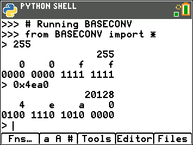
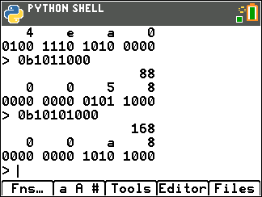

# BASECONV

Simple base conversion program for TI-83 Premium CE Python Edition
calculators. Written in Python.

Takes a decimal, binary (prefix: `0b`), or hexadecimal (`0x`) 
number and writes its decimal, hexadecimal and binary conversions
ready to use in assembly programs.

Formatting defaults to 16 bits.

 

Decimal and hexadecimal input

Binary input
